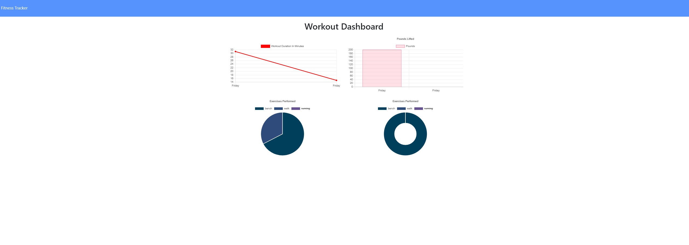

# **Workout-Tracker**

## **Greetings!**
### **_This is an app utilizing the MongoDB and mongoose to create the database and deploy to heroku_** 

---
## **How To Use:**

## **Link to the video: <https://drive.google.com/file/d/1spqxoQqsseqE0vdNccj3s2Xln35DeL65/view>**
---
## **Description:**
#### 1. **_This program allows the user to "Add New Workout" or "Continue the workout"._** 
 

#### 2. **_Once the user decides to add new workout from "resistance" or "cardio" section, they can add information about each categorized workout section._**
 

#### 3. **_Once the workout information is added, the user can check out total data of their workout routines on the main page._**
 

#### 4. **_Lastly, if the user would like to access the graphs and other visualized statistics about their workout data, they can click "Dashboard" on top left corner section to check them out._**

---

## **Installation**
### **_git clone this: <git@github.com:ahnlok/workout-tracker.git>_**

---
## **GitHub**
### **_GitHub_**: **<https://github.com/ahnlok/workout-tracker>**
### **_Deployed Github Site_**: **<https://ahnlok.github.io/workout-tracker/>**
### **_Heroku Deployed: <https://pacific-mesa-01605.herokuapp.com/>_**

---

## **Contact**
### **_E-Mail_**: **<ansungpil1@gmail.com>**
### **_LinkedIn_**: **<https://www.linkedin.com/in/an-sungpil-95ab8490/>**
### **_GitHub_**: **<https://github.com/ahnlok>**

---
## **License**
### **© Sungpil An 2021**

#### _Licensed under the MIT License_